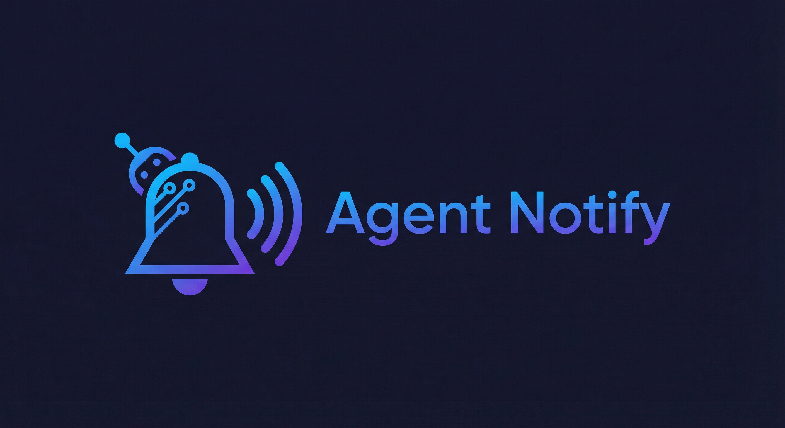

<p align="center">
  
</p>

<p align="center">
  🔔 Audio notifications &nbsp;·&nbsp; 🗣️ Text-to-speech with per-agent voices &nbsp;·&nbsp; 🔌 MCP integration<br>
  💬 Message stream &nbsp;·&nbsp; 🤝 Agent-to-agent conversations &nbsp;·&nbsp; 👁️ Multi-window watch mode<br>
  📦 App &amp; CI notifications &nbsp;·&nbsp; 🔄 Sequential queue &nbsp;·&nbsp; ⌨️ Remote keyboard controls
</p>

## 📑 Table of Contents

- [✨ Features](#features)
- [🏗️ Architecture](#architecture)
- [🔔 Notification Types](#notification-types)
- [📥 Installation](#installation)
- [⚙️ Configuration](#configuration)
  - [🌐 Server Connection URL](#server-connection-url)
  - [🔗 Notification Links (App Only)](#notification-links-app-only)
- [🚀 Usage](#usage)
  - [💻 Command Line Interface](#command-line-interface)
  - [🔌 MCP Integration (Cursor AI)](#mcp-integration-cursor-ai)
  - [🌐 HTTP API](#http-api)
  - [⚙️ Programmatic Usage](#programmatic-usage)
- [📦 App Notifications](#app-notifications)
  - [📊 App Log Levels](#app-log-levels)
  - [🎚️ Log Level Configuration](#log-level-configuration)
- [🔄 Notification Queue](#notification-queue)
- [🪟 Multi-Window & Multi-Agent Support](#multi-window--multi-agent-support)
  - [📋 Console Log Format](#console-log-format)
  - [🗣️ TTS Spoken Order](#tts-spoken-order)
  - [🤖 Agent Zero Convention](#agent-zero-convention)
- [💬 Message Stream](#message-stream)
  - [🔄 Incremental Polling](#incremental-polling)
  - [🎧 Playback Tracking](#playback-tracking)
- [🤝 Agent-to-Agent Conversations](#agent-to-agent-conversations)
  - [⏳ Turn-Taking Protocol](#turn-taking-protocol)
- [🎙️ Voice System](#voice-system)
  - [🗺️ Voice Maps](#voice-maps)
- [👁️ Watch Mode](#watch-mode)
- [⌨️ Keyboard Controls](#keyboard-controls)
- [🎵 Sound Files](#sound-files)
- [💾 Message Persistence](#message-persistence)
- [🛠️ Development](#development)
- [📋 Requirements](#requirements)
- [📄 License](#license)
- [👤 Author](#author)

<a id="features"></a>

## ✨ Features

- 🎵 **Audio Notifications** - Plays distinct sounds for different notification types
- 🗣️ **Text-to-Speech** - Vocalizes notification messages using macOS `say` command
- 🎙️ **Multi-Agent Voice System** - Distinct TTS voices per agent role or number
- 📂 **Project Identification** - Identifies which project/workspace a notification came from
- 🎨 **Visual Feedback** - Clean console output with emoji-led metadata and dim message text
- 🔌 **MCP Integration** - Works seamlessly with Cursor AI and other MCP-compatible tools
- 📦 **App Notifications** - Build tools, CI scripts, and deploy pipelines can fire notifications
- 🔄 **Notification Queue** - Sequential playback — notifications never overlap
- 💬 **Message Stream** - Persistent message store with incremental polling and playback tracking
- 🤝 **Agent Conversations** - Orchestrator-driven agent-to-agent audio conversations with turn-taking
- 📊 **Log Levels** - Configurable console and audio thresholds for app notifications
- ⌨️ **Keyboard Control** - Spacebar to stop all, S to skip current, M to mute agent messages
- 👁️ **Watch Mode** - Display-only panels that mirror notifications without playing audio
- 🔗 **Synced Controls** - Mute, stop, and skip sync across all panels via remote control endpoints
- 🌐 **HTTP API** - RESTful endpoints for external integrations
- 💾 **Disk Persistence** - Message store survives server restarts

<a id="architecture"></a>

## 🏗️ Architecture

```
Agent (MCP)      ──▶  MCP tool "notify"  ──▶  HTTP /notify/agent  ──┐
                                                                     ├──▶  message store  ──▶  notification queue  ──▶  sequential playback
Agent (HTTP/CLI) ──▶  HTTP /notify/agent  ──────────────────────────┤
                                                                     │
App (HTTP/CLI)   ──▶  HTTP /notify/app  ────────────────────────────┘

Agent (MCP)      ──▶  MCP tool "get_messages"                ──▶  HTTP /messages                       ──▶  message store (read)
Agent (MCP)      ──▶  MCP tool "check_message_status"       ──▶  HTTP /messages/status                ──▶  counters only (read)
Agent (MCP)      ──▶  MCP tool "check_responses_available"  ──▶  HTTP /responses/available/for/id/:id  ──▶  message store (count)
Agent (MCP)      ──▶  MCP tool "check_responses_observed"   ──▶  HTTP /responses/observed/for/id/:id   ──▶  message store (count)
```

- **`/notify/agent`** — for all AI agent notifications (MCP, HTTP, or CLI). Always plays audio and logs to console.
- **`/notify/app`** — for all application notifications (HTTP or CLI). Subject to log level thresholds.
- **`/messages`** — query the persistent message stream. Supports incremental polling and playback tracking.
- **`/responses/available/for/id/:id`** — count responses to a message (bus mode, ~5 tokens)
- **`/responses/observed/for/id/:id`** — count observed responses (conversational mode, ~5 tokens)
- **Five MCP tools** — `notify`, `get_messages`, `check_message_status`, `check_responses_available`, `check_responses_observed`.
- **One CLI** — `notify` command. If `--app` flag is present → `/notify/app`; otherwise → `/notify/agent`.
- **One queue** — both endpoints feed into the same FIFO queue. Sequential playback, no overlap.
- **One message store** — every notification is persisted. Survives server restarts.

<a id="notification-types"></a>

## 🔔 Notification Types

### 🤖 Agent Types

| Type | Emoji | Description | Use Case |
|------|-------|-------------|----------|
| `done` | ✅ | Task completion | Successful operations |
| `error` | ❌ | Error occurred | Failed operations |
| `question` | ❓ | Need user input | Waiting for decisions |
| `permission` | 🔐 | Need authorization | Requiring user approval |
| `status` | 📡 | Progress update | Ongoing operations |
| `waiting` | ⏳ | Processing | Long-running tasks |
| `review` | 👁️ | Code review needed | File changes ready |
| `message` | 💬 | Agent conversation | Agent-to-agent dialogue |

### 📦 App Log Levels

| Level | Emoji | Sound | Use Case |
|-------|-------|-------|----------|
| `debug` | 🐛 | *(none)* | Verbose debug info |
| `info` | ℹ️ | status.mp3 | General information, progress updates |
| `warn` | ⚠️ | waiting.mp3 | Warnings, deprecations, non-critical issues |
| `error` | ❌ | error.mp3 | Failures, crashes, critical issues |
| `success` | ✅ | done.mp3 | Build complete, tests passed, deploy finished |

<a id="installation"></a>

## 📥 Installation

```bash
# Clone the repository
git clone <repository-url>
cd agent-notify

# Install globally
npm install -g

# Link globally for customization
npm link
```

<a id="configuration"></a>

## ⚙️ Configuration

<a id="server-connection-url"></a>

### 🌐 Server Connection URL

By default, the notification clients (CLI and MCP) connect to `http://localhost:8881`. To use a different server address, set the `AGENT_NOTIFY_URL` environment variable.

#### For CLI Usage

```bash
# Set for current shell session
export AGENT_NOTIFY_URL="http://192.168.0.6:8881"
notify done "Task complete"

# Set for single command
AGENT_NOTIFY_URL="http://192.168.0.6:8881" notify done "Task complete"

# Add to ~/.bashrc or ~/.zshrc for persistence
echo 'export AGENT_NOTIFY_URL="http://192.168.0.6:8881"' >> ~/.bashrc
```

#### For MCP (Cursor) Usage

Add the `env` block to your Cursor `settings.json`:

```json
{
  "mcpServers": {
    "agent-notify": {
      "command": "notify-mcp",
      "env": {
        "AGENT_NOTIFY_URL": "http://192.168.0.6:8881"
      }
    }
  }
}
```

#### Finding Your Server's IP Address

```bash
# macOS
ipconfig getifaddr en0    # WiFi
ipconfig getifaddr en1    # Ethernet

# Linux
hostname -I

# The server prints its address on startup:
# 📡 Listening on http://0.0.0.0:8881
```

#### Troubleshooting

| Issue | Solution |
|-------|----------|
| **Connection refused** | Check that the server is running (`npm start`) and the URL is correct |
| **Wrong IP address** | Use the commands above to find your server's IP, then set `AGENT_NOTIFY_URL` |
| **Port already in use** | The server auto-switches to [watch mode](#watch-mode). Or use a different port: `node lib/server.mjs --address 0.0.0.0:9000` |
| **Cross-machine access** | Ensure the server uses `0.0.0.0` (default) not `localhost` |

<a id="notification-links-app-only"></a>

### 🔗 Notification Links (App Only)

App notifications can include an optional clickable link (e.g., to a CI build, deploy dashboard, or health check endpoint). The link appears as a third line in the server terminal output and is **not** spoken via TTS.

**Security Note:** Links are deliberately excluded from agent notifications. AI agents are untrusted URL sources — allowing models to inject arbitrary clickable URLs creates a phishing/malicious link surface. Links are only available for app notifications, which come from user-controlled code.

#### CLI Usage

```bash
# Attach a dashboard link
notify success "Deploy complete" --app my-api --link https://my-api.example.com/health

# Attach a CI build link
notify error "Build failed" --app github-actions --link https://github.com/user/repo/actions/runs/12345

# Links are optional
notify info "Starting deploy..." --app deploy
```

#### HTTP API Usage

```bash
curl "http://localhost:8881/notify/app?type=success&message=Deploy%20complete&app=my-api&url=https://my-api.example.com/health"
```

#### Server Terminal Output

```
✅ SUCCESS 📦 my-api
"Deploy complete"
🔗 https://my-api.example.com/health
```

The URL is automatically clickable in most terminals (iTerm2, VS Code terminal, Hyper, etc.).

<a id="usage"></a>

## 🚀 Usage

<a id="command-line-interface"></a>

### 💻 Command Line Interface

```bash
# Agent notification (type and message only)
notify done "Task completed successfully"
notify error "Something went wrong"
notify question "Do you want to continue?"

# Agent with project identification
notify done "Build complete" --workspace-dir /Users/user/repos/my-app

# Agent multi-agent (orchestrator)
notify done "All tasks complete" --workspace-dir /Users/user/repos/my-app --agent-role Orchestrator --agent-number 0

# Agent subagent with full context
notify done "Build complete" --workspace-dir /Users/user/repos/my-app --agent-role Coder --agent-number 2 --model claude-4.6-sonnet

# Agent override TTS voice
notify status "Processing..." --voice Nathan

# App notification
notify success "Build complete" --app webpack
notify error "3 tests failed" --app jest
notify info "Starting deploy..." --app deploy
notify debug "Cache hit ratio 95%" --app webpack
```

#### 🏁 CLI Flags

| Flag | HTTP Query Param | Description |
|------|-----------------|-------------|
| *(positional 1)* | `type` | Notification type or app log level (required) |
| *(positional 2)* | `message` | Message text (required) |
| `--workspace-dir` | `workspaceDir` | Full workspace path — project name derived from last segment (agent notifications only) |
| `--agent-role` | `agentRole` | Agent role name (e.g., "Coder", "Orchestrator") (agent notifications only) |
| `--agent-number` | `agentNumber` | Agent number (Orchestrator = 0, subagents = 1, 2, 3...) (agent notifications only) |
| `--voice` | `voice` | TTS voice override |
| `--model` | `model` | Your exact model identifier (e.g., "claude-4.6-opus-high") (agent notifications only) |
| `--app` | `app` | App name — routes to `/notify/app` endpoint |
| `--link` | `url` | Attach a clickable link to app notification (app notifications only, not spoken) |

<a id="mcp-integration-cursor-ai"></a>

### 🔌 MCP Integration (Cursor AI)

Add to your Cursor settings (`settings.json`):

```json
{
  "mcpServers": {
    "agent-notify": {
      "command": "notify-mcp"
    }
  }
}
```

Then configure the notification rules:

**Option 1: Project-specific** - Copy the rules from [`.cursorrules`](.cursorrules) to your project's `.cursorrules` file

**Option 2: Global** - Add the rules from [`.cursorrules`](.cursorrules) globally in: `Settings > Rules & Commands > Add` to use across all projects

#### 📝 MCP Tool Schema

```javascript
mcp_agent-notify_notify({
  type: "done",                               // Required: notification type
  message: "Build complete",                  // Required: message text
  workspaceDir: "/Users/user/repos/my-app",   // Optional: Workspace Path from <user_info>
  agentRole: "Coder",                         // Optional: agent role name
  agentNumber: 2,                             // Optional: agent number (0 = orchestrator)
  voice: "Nathan",                            // Optional: TTS voice override
  model: "claude-4.6-sonnet",                  // Required: exact model identifier (console log only)
  to: "Reviewer",                             // Optional: recipient for agent conversations
  response_to: 225                            // Optional: message ID this is a reply to
})
```

**Note:** The MCP tool is exclusively for agents. App notifications should use the CLI (`--app` flag) or HTTP API (`/notify/app`) directly.

#### 📋 MCP Parameter Descriptions

| Parameter | Type | Required | Description |
|-----------|------|----------|-------------|
| `type` | string | Yes | Notification type: question, permission, done, error, status, waiting, review, message |
| `message` | string | Yes | Message to vocalize |
| `workspaceDir` | string | No | The Workspace Path from `<user_info>`. Used to identify which project this notification is from. |
| `agentRole` | string | No | Agent role name assigned by orchestrator (e.g., "Coder", "Reviewer"). The orchestrator itself should use "Orchestrator". |
| `agentNumber` | integer | No | Agent number assigned by orchestrator. Orchestrator = 0, subagents = 1, 2, 3, etc. |
| `voice` | string | No | Override the TTS voice for this notification. If omitted, the server selects a voice based on agentRole or agentNumber. |
| `model` | string | Yes | Your exact model identifier as shown in system info (e.g., "claude-4.6-opus-high", "gpt-4o-2025-03"). Console log only. |
| `to` | string | No | Agent role or name this message is directed to (e.g., "Reviewer", "Coder"). Used for agent-to-agent conversations. Display/filtering only — does not route messages. |
| `response_to` | integer | No | Message ID this is a reply to. Enables lightweight response polling via `check_responses_available` and `check_responses_observed`. |

#### 📬 MCP `get_messages` Tool

Poll the persistent message stream for notifications. Supports incremental polling via `since_id`.

```javascript
mcp_agent-notify_get_messages({
  since_id: 42,          // Optional: only messages after this ID (0 for initial fetch)
  limit: 50,             // Optional: max messages to return (default 50, max 200)
  type: "message",       // Optional: filter by notification type
  to: "Coder",           // Optional: filter by recipient
  project: "my-app",     // Optional: filter by project name
  source: "agent",       // Optional: filter by source ("agent" or "app")
  agentRole: "Reviewer", // Optional: filter by agent role
  agentNumber: 2,        // Optional: filter by agent number
  model: "claude-opus",  // Optional: filter by model
  voice: "Samantha",     // Optional: filter by TTS voice
  app: "webpack"         // Optional: filter by app name
})
```

**Response:**

```json
{
  "messages": [
    {
      "id": 47,
      "timestamp": "2025-03-01T04:40:07.000Z",
      "prevHash": "a3f2c1e809b7d4f2",
      "source": "agent",
      "type": "message",
      "message": "Build complete",
      "project": "my-app",
      "agentRole": "Coder",
      "agentNumber": 1,
      "model": "claude-opus-4-6",
      "voice": "Nathan",
      "to": "Reviewer"
    }
  ],
  "latest_id": 47,
  "last_played_id": 47
}
```

- `latest_id` — highest message ID in the store (use as `since_id` for next poll)
- `last_played_id` — highest message ID whose audio has finished playing (derived from internal played events)
- Played events (`type: "played"`) are filtered out of results — they are internal bookkeeping

#### ⚡ MCP `check_message_status` Tool

**ALWAYS use `check_message_status` for turn-taking and playback polling — NEVER use `get_messages` for this.** Returns ~30 tokens instead of ~400-600, saving thousands of tokens over a conversation.

```javascript
mcp_agent-notify_check_message_status({
  since_id: 46   // Optional: check for messages newer than this ID
})
```

**Response:**

```json
{
  "latest_id": 47,
  "last_played_id": 45,
  "muted": false,
  "has_new": true,
  "queue_length": 2,
  "agents": [
    {
      "project": "my-app",
      "agentRole": "Coder",
      "agentNumber": 1,
      "model": "claude-opus-4-6",
      "voice": "Nathan",
      "to": "Reviewer",
      "latestId": 47,
      "played": false
    }
  ]
}
```

- `latest_id` — highest message ID in the store
- `last_played_id` — highest message ID whose audio has finished playing
- `has_new` — true if `latest_id > since_id`
- `queue_length` — number of notifications waiting in the audio queue
- `agents` — deduplicated array of agents that have posted since `since_id`. Each agent is identified by the composite key `project + agentRole + agentNumber`. Fields `model`, `voice`, and `to` reflect the agent's most recent message. `latestId` is that message's ID, and `played` is true if its audio has finished.

Only use `get_messages` when you need actual message content.

#### ⚡ MCP `check_responses_available` Tool

Check if any responses have been sent to a specific message. Returns a count. Use for **bus-mode polling** — you only need to know if a reply exists, regardless of whether the human has heard it.

```javascript
mcp_agent-notify_check_responses_available({
  id: 225   // Required: the message ID to check for responses to
})
```

**Response:** `{"n":1}` (~5 tokens)

#### ⚡ MCP `check_responses_observed` Tool

Check if any responses to a specific message have been heard by the human (audio played). Returns a count. Use for **conversational-mode polling** — wait for the human to actually hear the reply before proceeding.

```javascript
mcp_agent-notify_check_responses_observed({
  id: 225   // Required: the message ID to check for observed responses to
})
```

**Response:** `{"n":0}` (~5 tokens)

<a id="http-api"></a>

### 🌐 HTTP API

Start the notification server:

```bash
# Default (listens on 0.0.0.0:8881 - accessible from network)
npm start

# With custom log levels for app notifications
node lib/server.mjs --log-level debug --log-level-audio warn

# Cross-network access (recommended for SSH/remote projects)
node lib/server.mjs --address 0.0.0.0:8881

# Custom IP and port
node lib/server.mjs --address 192.168.1.100:8881

# Custom port only (uses 0.0.0.0 as host)
node lib/server.mjs --address 9000

# Localhost only (NOT accessible from other machines)
node lib/server.mjs --address localhost:8881

# Watch mode — display only, no audio (auto-detects or explicit)
node lib/server.mjs --watch

# Custom store directory
node lib/server.mjs --store /path/to/store-dir

# Skip startup confirmation prompt
node lib/server.mjs --yes

# Clear message history and start fresh
node lib/server.mjs --clear
```

**🌍 Network Access:**
- `0.0.0.0` - 🌐 Accessible from any machine on your network (recommended)
- `localhost/127.0.0.1` - 🏠 Only accessible from the same machine
- Specific IP - 🎯 Only accessible via that network interface

Send notifications via HTTP:

```bash
# Agent notification
curl "http://localhost:8881/notify/agent?type=done&message=Build%20complete&model=claude-4.6-opus-high"

# Agent with full context
curl "http://localhost:8881/notify/agent?type=done&message=Build%20complete&workspaceDir=/Users/user/repos/my-app&agentRole=Coder&agentNumber=2&model=claude-4.6-sonnet"

# App notification
curl "http://localhost:8881/notify/app?type=success&message=Build%20complete&app=webpack"

# App notification with link
curl "http://localhost:8881/notify/app?type=success&message=Deploy%20complete&app=my-api&url=https://my-api.example.com/health"

# App debug (only shown if --log-level allows it)
curl "http://localhost:8881/notify/app?type=debug&message=Cache%20hit%20ratio%2095%25&app=webpack"
```

#### 🤖 `/notify/agent` Parameters

| Parameter | Required | Description |
|-----------|----------|-------------|
| `type` | Yes | Notification type (question, permission, done, error, status, waiting, review, message) |
| `message` | Yes | Message text |
| `model` | Yes | Exact model identifier (e.g., "claude-4.6-opus-high") |
| `workspaceDir` | No | Full workspace path (project name derived from last segment) |
| `agentRole` | No | Agent role name |
| `agentNumber` | No | Agent number |
| `voice` | No | TTS voice override |
| `to` | No | Recipient agent role/name (for agent conversations, display/filtering only) |
| `response_to` | No | Message ID this is a reply to. Enables lightweight response polling. |

#### 📦 `/notify/app` Parameters

| Parameter | Required | Description |
|-----------|----------|-------------|
| `type` | Yes | Log level (debug, info, warn, error, success) |
| `message` | Yes | Message text |
| `app` | Yes | App name (e.g., "webpack", "jest", "github-actions") |
| `voice` | No | TTS voice override |
| `url` | No | URL to attach as clickable link (not spoken, visual only) |

#### 📬 `/messages` Parameters

| Parameter | Required | Description |
|-----------|----------|-------------|
| `since_id` | No | Return messages with ID greater than this (0 for initial fetch) |
| `limit` | No | Max messages to return (default 50, max 200) |
| `type` | No | Filter by notification type |
| `to` | No | Filter by recipient agent role/name |
| `project` | No | Filter by project name |
| `source` | No | Filter by source ("agent" or "app") |
| `agentRole` | No | Filter by agent role |
| `agentNumber` | No | Filter by agent number |
| `model` | No | Filter by model identifier |
| `voice` | No | Filter by TTS voice |
| `app` | No | Filter by app name |
| `response_to` | No | Filter to messages that are replies to this message ID |

```bash
# Get all recent messages
curl "http://localhost:8881/messages"

# Incremental poll (only new messages since ID 42)
curl "http://localhost:8881/messages?since_id=42"

# Filter by type and recipient
curl "http://localhost:8881/messages?type=message&to=Coder"
```

#### 🔄 `/responses/available/for/id/:id`

Count responses to a message (bus mode — all sent, regardless of playback).

| Parameter | Required | Description |
|-----------|----------|-------------|
| `:id` (path) | Yes | Message ID to check for responses to |

```bash
curl "http://localhost:8881/responses/available/for/id/225"
# → {"n":1}
```

#### 🔄 `/responses/observed/for/id/:id`

Count observed responses to a message (conversational mode — only those whose audio has been played).

| Parameter | Required | Description |
|-----------|----------|-------------|
| `:id` (path) | Yes | Message ID to check for observed responses to |

```bash
curl "http://localhost:8881/responses/observed/for/id/225"
# → {"n":0}
```

<a id="programmatic-usage"></a>

### ⚙️ Programmatic Usage

```javascript
import { execSync } from 'child_process';

// Agent notification
execSync('notify done "Operation completed" --model claude-4.6-opus-high');

// Agent with workspace context
execSync('notify done "Build finished" --workspace-dir /Users/user/repos/my-app --model claude-4.6-opus-high');

// App notification
execSync('notify success "Build complete" --app webpack');
```

<a id="app-notifications"></a>

## 📦 App Notifications

App notifications allow build tools, CI scripts, deploy pipelines, test runners, and any other application to fire notifications alongside agent notifications.

<a id="app-log-levels"></a>

### 📊 App Log Levels

Apps use logger-style levels instead of agent notification types:

| Level | Sound | Emoji | Use Case |
|-------|-------|-------|----------|
| `debug` | *(none by default)* | 🐛 | Verbose debug info |
| `info` | status.mp3 | ℹ️ | General information, progress updates |
| `warn` | waiting.mp3 | ⚠️ | Warnings, deprecations, non-critical issues |
| `error` | error.mp3 | ❌ | Failures, crashes, critical issues |
| `success` | done.mp3 | ✅ | Build complete, tests passed, deploy finished |

**Hierarchy (lowest to highest):** `debug < info < warn < error < success`

<a id="log-level-configuration"></a>

### 🎚️ Log Level Configuration

Two server flags control what app notifications are shown and heard:

| Flag | Default | Description |
|------|---------|-------------|
| `--log-level` | `info` | Minimum level to show in console. Below this, the notification is completely ignored. |
| `--log-level-audio` | `info` | Minimum level to play sound + TTS. Below this, the notification is logged to console only (no audio, no queue entry). |

**💡 Examples:**

```bash
# Default: see and hear everything except debug
node lib/server.mjs

# See everything in console, only hear warnings and above
node lib/server.mjs --log-level debug --log-level-audio warn

# See and hear everything including debug
node lib/server.mjs --log-level debug --log-level-audio debug

# Only see and hear errors and successes
node lib/server.mjs --log-level error --log-level-audio error
```

**⚠️ Important:** Log level flags apply to app notifications only. Agent notifications always play audio and log to console regardless of these settings.

### 🔗 Example Integrations

#### 📦 npm scripts (package.json)

```json
{
  "scripts": {
    "build": "webpack --mode production",
    "postbuild": "notify success 'Build complete' --app webpack",
    "test": "jest",
    "posttest": "notify success 'Tests passed' --app jest"
  }
}
```

#### 🐚 Shell script

```bash
#!/bin/bash
notify info "Starting deploy..." --app deploy
npm run build
if [ $? -eq 0 ]; then
  notify success "Deploy successful" --app deploy --link https://my-api.example.com/health
else
  notify error "Deploy failed" --app deploy --link https://github.com/user/repo/actions/runs/12345
fi
```

#### 🌐 curl (HTTP)

```bash
# App notification with link
curl "http://localhost:8881/notify/app?type=success&message=Pipeline%20complete&app=github-actions&url=https://github.com/user/repo/actions/runs/12345"

# App notification without link
curl "http://localhost:8881/notify/app?type=success&message=Pipeline%20complete&app=github-actions"

# Agent notification (links not supported for security)
curl "http://localhost:8881/notify/agent?type=done&message=Build%20complete&model=claude-4.6-opus-high"
```

<a id="notification-queue"></a>

## 🔄 Notification Queue

When multiple notifications arrive simultaneously (from parallel agents, apps, or a mix), a server-side FIFO queue ensures they play sequentially — one at a time, never overlapping. All callers receive an immediate response.

### ⚙️ Queue Behavior

1. **Every notification is queued** — when a request arrives, it's added to the end of the queue
2. **Sequential playback** — only one notification plays at a time (sound + TTS). The next one starts only after the previous one completes
3. **Immediate response** — the server always responds immediately with `{ success: true, queued: true, position: N }`
4. **Log level filtering** — app notifications below the `--log-level-audio` threshold are logged to console but not enqueued (no audio)

<a id="multi-window--multi-agent-support"></a>

## 🪟 Multi-Window & Multi-Agent Support

When running multiple Cursor windows and parallel agents, the notification system identifies the source of each notification through project name, agent role, and agent number.

<a id="console-log-format"></a>

### 📋 Console Log Format

#### 🤖 Agent Notifications

Emoji-led format with notification type capitalized. Message displayed in dim text on its own line, followed by a blank line separator. Optional fields omitted when not provided:

```shell
# Orchestrator (full):
✅ DONE 📂 my-app 🤖 Orchestrator #0 🧠 claude-4.6-opus-high
"All tasks complete"

# Subagent (full):
✅ DONE 📂 my-app 🤖 Coder #2 🧠 claude-4.6-sonnet
"Build complete"

# Solo agent (with workspaceDir):
✅ DONE 📂 my-app 🧠 claude-4.6-opus-high
"Build complete"

# Solo agent (no workspaceDir):
✅ DONE 🧠 claude-4.6-opus-high
"Build complete"
```

#### 📦 App Notifications

```shell
✅ SUCCESS 📦 webpack
"Build complete in 4.2s"

❌ ERROR 📦 jest
"3 tests failed in auth.test.ts"

ℹ️ INFO 📦 deploy
"Starting deployment to staging"

⚠️ WARN 📦 eslint
"12 warnings found"

🐛 DEBUG 📦 webpack
"Module resolution: ./src/index.ts → ./dist/index.js"

# With optional link (3-line format):
✅ SUCCESS 📦 my-api
"Deploy complete"
🔗 https://my-api.example.com/health
```

- `📦` emoji for app source (vs `🤖` for agents)
- No model field (apps don't have models)
- No project folder (workspaceDir not supported for apps)
- `app` name shown where agent role would be

<a id="tts-spoken-order"></a>

### 🗣️ TTS Spoken Order

The notification sound and TTS speech run independently and in parallel. The sound fires immediately, and TTS begins after a 500ms delay. The spoken order matches the screen reading order — parts are omitted when not provided:

#### 🤖 Agent Spoken Order

1. **Message type** (always included, e.g., "done", "question")
2. **Project name** (from `workspaceDir` last segment — omitted if not provided)
3. **Agent role** (if provided, e.g., "Coder")
4. **Agent number** (if provided, e.g., "Agent 2" or "Agent Zero" for orchestrator)
5. **Message text** (always included)

**Examples:**
- `"done, my-app, Coder, Agent 2, Build complete"` — full context
- `"done, my-app, Build complete"` — solo agent with workspaceDir
- `"done, Build complete"` — solo agent, no workspaceDir

#### 📦 App Spoken Order

1. **Log level** (e.g., "success", "error")
2. **App name** (e.g., "webpack")
3. **Message text**

**Note:** The optional `url` parameter is **not** spoken via TTS. URLs are visual-only in the console output.

**Examples:**
- `"success, webpack, Build complete in 4.2 seconds"`
- `"error, jest, 3 tests failed"`

<a id="agent-zero-convention"></a>

### 🤖 Agent Zero Convention

When using an orchestrator with multiple subagents:

- **Orchestrator** = `agentRole="Orchestrator"`, `agentNumber=0` → spoken as "Orchestrator, Agent Zero"
- **Subagent 1** = `agentRole="Coder"`, `agentNumber=1` → spoken as "Coder, Agent 1"
- **Subagent 2** = `agentRole="Reviewer"`, `agentNumber=2` → spoken as "Reviewer, Agent 2"

<a id="message-stream"></a>

## 💬 Message Stream

Every notification sent via `notify` is stored in a persistent message stream. Use the `/messages` endpoint (or `get_messages` MCP tool) to query the stream for monitoring, polling, or reading conversation history.

<a id="incremental-polling"></a>

### 🔄 Incremental Polling

Use `since_id` for efficient incremental polling:

1. **First fetch** — pass `since_id=0` to get recent messages
2. **Note `latest_id`** from the response
3. **Subsequent polls** — pass `since_id=<latest_id>` to get only new messages

```bash
# Initial fetch
curl "http://localhost:8881/messages?since_id=0"
# → { "messages": [...], "latest_id": 42, "last_played_id": 42 }

# Next poll — only new messages
curl "http://localhost:8881/messages?since_id=42"
```

<a id="playback-tracking"></a>

### 🎧 Playback Tracking

The message stream tracks audio playback state:

- **`last_played_id`** — the highest message ID whose audio has finished playing (derived from internal played events)

Use this to know when a message has been heard before sending the next one. This is the foundation for the [turn-taking protocol](#turn-taking-protocol).

<a id="agent-to-agent-conversations"></a>

## 🤝 Agent-to-Agent Conversations

The orchestrator creates audio conversations by sending `notify` on behalf of different agents. The user hears each agent in a distinct TTS voice — the conversation unfolds live through audio.

**The orchestrator drives the conversation.** Individual agents don't need to independently poll the stream — the orchestrator:
- Decides what each agent says and when
- Sends `notify` using each agent's `agentRole` and `agentNumber`
- Waits for each message to finish playing before sending the next

Agents *can* independently poll `get_messages` for cross-tool scenarios (e.g., bridging Cursor and Claude Code agents via the shared message stream).

<a id="turn-taking-protocol"></a>

### ⏳ Turn-Taking Protocol

The orchestrator must wait for each message to finish playing before sending the next. Without this, messages queue up faster than audio can play and the conversation loses its natural pacing.

**Flow:**

1. **Send** on behalf of an agent — note the returned `id`:
   ```
   notify(type="message", to="Reviewer", message="...", agentRole="Coder", agentNumber=1) → id: 47
   ```

2. **Wait** for audio to finish — poll `check_message_status` until `last_played_id >= 47`:
   ```
   check_message_status(since_id=46) → { last_played_id: 46, has_new: true }  # still playing
   check_message_status(since_id=46) → { last_played_id: 47, has_new: true }  # done — send next turn
   ```

3. **Send the next turn** on behalf of the other agent, only after the previous message has been played.

**Key details:**

- The orchestrator waits for each message's `id`, not for the queue to be empty. Multiple conversations can run simultaneously without blocking each other.
- When the user skips audio (spacebar), all queued messages are marked as played immediately, so the orchestrator proceeds without getting stuck.
- Use `type="message"` for conversation turns; reserve other types for their intended purpose.
- The `to` parameter indicates who the message is addressed to (for display/filtering) — it does not route or deliver messages.

#### Lightweight Turn-Taking (response polling)

For agent-to-agent conversations where each agent independently polls for replies:

1. **Agent A sends** with `response_to` pointing at the message it's replying to:
   ```
   notify(type="message", message="...", response_to=225) → id: 226
   ```

2. **Agent B polls** for available or observed responses:
   ```
   check_responses_observed(id=226) → {"n":0}  # not heard yet
   check_responses_observed(id=226) → {"n":1}  # reply heard — proceed
   ```

3. **Agent B reads the reply** (if content needed):
   ```
   get_messages(response_to=226)
   ```

This uses ~5 tokens per poll instead of ~50-100 with `check_message_status`.

<a id="voice-system"></a>

## 🎙️ Voice System

The server selects a TTS voice using a triple fallback strategy:

1. **Voice override** — If `voice` param is provided, use it directly (highest priority)
2. **Role-based map** — If `agentRole` matches a role in the map, use that voice
3. **Index-based map** — If `agentNumber` matches an index in the map, use that voice
4. **System default** — Use macOS default voice

<a id="voice-maps"></a>

### 🗺️ Voice Maps

| Agent Role | Voice | Region |
|------------|-------|--------|
| Orchestrator | System default | - |
| Coder | Nathan | America |
| Reviewer | Samantha | America |
| Tester | Karen | Australia |
| Designer | Zoe | America |
| Researcher | Serena | America |
| Debugger | Lee | America |
| DevOps | Evan | America |
| Writer | Matilda | America |
| Planner | Catherine | Australia |
| Security | Ava | America |
| Refactorer | Siri 1 | America |
| Analyst | Siri 2 | America |
| Migrator | Siri 3 | America |

| Agent Number | Voice | Region |
|--------------|-------|--------|
| 0 | System default | - |
| 1 | Nathan | America |
| 2 | Samantha | America |
| 3 | Karen | Australia |
| 4 | Zoe | America |
| 5 | Serena | America |
| 6 | Lee | America |
| 7 | Evan | America |
| 8 | Matilda | America |
| 9 | Catherine | Australia |
| 10 | Ava | America |
| 11 | Siri 1 | America |
| 12 | Siri 2 | America |
| 13 | Siri 3 | America |

Voice maps are configured server-side in `lib/server.mjs` for centralized management.

App notifications use **Lee** (Australian male) as the default voice to distinguish them from the predominantly American agent voices. This can be overridden with the `voice` parameter.

<a id="watch-mode"></a>

## 👁️ Watch Mode

Watch mode lets you open additional terminal panels that mirror all notifications without playing audio. Useful for monitoring from multiple windows or screens.

### Starting Watch Mode

Watch mode activates automatically or explicitly:

```bash
# Auto-detect — if port is already in use, switches to watch mode
npm start

# Explicit — skip port binding, go straight to watch mode
node lib/server.mjs --watch
```

When auto-detected, you'll see:

```
⚠️  Port 8881 already in use — switching to watch mode
```

Watch mode polls the primary server's `/messages` endpoint every second and renders new notifications with the same colored formatting.

### Synced Controls

Keyboard controls work from any panel — watch mode sends commands to the primary server via `POST /controls/*` endpoints, and the action is broadcast to all panels through the message stream:

| Endpoint | Action |
|----------|--------|
| `POST /controls/stop` | Stop all audio and clear the queue |
| `POST /controls/skip` | Skip the current notification |
| `POST /controls/mute` | Toggle mute for agent messages |

The `/messages` response includes a `muted` field so all panels stay in sync with the current mute state.

### What Watch Mode Does NOT Do

- No audio playback — display only
- No notification queue — read-only polling
- Never writes to the message store — completely passive
- Never writes to `/notify/*` — read-only

<a id="keyboard-controls"></a>

## ⌨️ Keyboard Controls

These controls work on both the primary server and any watch mode panel. In watch mode, keypresses are forwarded to the primary server and the resulting action syncs to all connected panels.

| Key | Action |
|-----|--------|
| **Spacebar** | Stop current audio AND clear the entire queue (discard all pending notifications) |
| **S** | Skip current notification, move to the next one in the queue |
| **M** | Toggle mute for `message` type notifications (conversations). Other types still play. |
| **Ctrl+C** | Exit the server (or watch mode panel) |

<a id="sound-files"></a>

## 🎵 Sound Files

The system uses predefined sound files located in the `sounds/` directory:

- 🎵 `done.mp3` - Success sound (also used for app `success`)
- 🔔 `error.mp3` - Error alert (also used for app `error`)
- ❓ `question.mp3` - Question prompt
- 🔐 `permission.mp3` - Authorization request
- 📡 `status.mp3` - Status update (also used for app `info`)
- ⏳ `waiting.mp3` - Processing sound (also used for app `warn`)

<a id="message-persistence"></a>

## 💾 Message Persistence

The message store lives in a `.agent-notify/` directory as an append-only JSONL file (`messages.jsonl`). Each message is written immediately — zero data loss on crash.

- **Messages survive server restarts** — the last 10,000 lines are loaded into memory on startup
- **Hash chain integrity** — each message stores a `prevHash` linking to the previous message; verified on startup to detect corruption
- **Playback as events** — playback state is tracked via append-only `played` events (no mutations)
- **Startup safety** — timestamped backup created on each startup; CLI confirmation prompt before accepting the store (`--yes` to skip)
- **Crash-safe** — no periodic flush, no full-file rewrites; every message is appended immediately
- **Store directory** — defaults to `.agent-notify/` in project root; configurable via `--store <dir>` or `$AGENT_NOTIFY_STORE` env var
- **Clear history** — `--clear` flag deletes the store and starts fresh
- **Auto-migration** — both `.message-store.json` (old blob format) and `.message-store.jsonl` (old flat file) are migrated into `.agent-notify/` automatically on first run
- **Watch mode safety** — only the primary server (port-bound process) writes to the store; watch mode and EADDRINUSE fallbacks are read-only

<a id="development"></a>

## 🛠️ Development

### 📁 Project Structure

```
agent-notify/
├── lib/
│   ├── notify.mjs      # CLI interface
│   ├── mcp.mjs         # MCP server (notify, get_messages, check_message_status, check_responses_available, check_responses_observed)
│   └── server.mjs      # HTTP server (queue, endpoints, message store, TTS)
├── sounds/             # Audio files
├── .agent-notify/            # Store directory (auto-generated, gitignored)
│   ├── messages.jsonl        # Append-only message stream
│   └── messages.jsonl.meta   # Sidecar metadata
├── package.json
└── README.md
```

### 🚀 Running the Server

```bash
# Start the notification server (default settings)
npm start

# Server runs on http://0.0.0.0:8881

# With custom log levels
node lib/server.mjs --log-level debug --log-level-audio warn
```

### 🧪 Testing

```bash
# Test agent notification
notify done "Test complete" --model claude-4.6-opus-high

# Test agent with project context
notify done "Test complete" --workspace-dir /Users/user/repos/test-project --model claude-4.6-opus-high

# Test agent multi-agent
notify done "Task finished" --workspace-dir /Users/user/repos/test-project --agent-role Coder --agent-number 1 --model claude-4.6-sonnet

# Test app notification
notify success "Build complete" --app webpack
notify error "Tests failed" --app jest
notify info "Deploying..." --app deploy
notify warn "Deprecation warning" --app eslint
notify debug "Verbose output" --app webpack

# Test all agent notification types
notify done "Test complete" --model claude-4.6-opus-high
notify error "Test error" --model claude-4.6-opus-high
notify question "Test question" --model claude-4.6-opus-high
notify permission "Test permission" --model claude-4.6-opus-high
notify status "Test status" --model claude-4.6-opus-high
notify waiting "Test waiting" --model claude-4.6-opus-high

# Test via HTTP
curl "http://localhost:8881/notify/agent?type=done&message=Test&model=test"
curl "http://localhost:8881/notify/app?type=success&message=Test&app=test"
```

<a id="requirements"></a>

## 📋 Requirements

- 🍎 macOS (uses `afplay` and `say` commands)
- 🟢 Node.js 18+
- 🔊 Audio output capability

<a id="license"></a>

## 📄 License

See LICENSE.md for details.

<a id="author"></a>

## 👤 Author

F1LT3R
